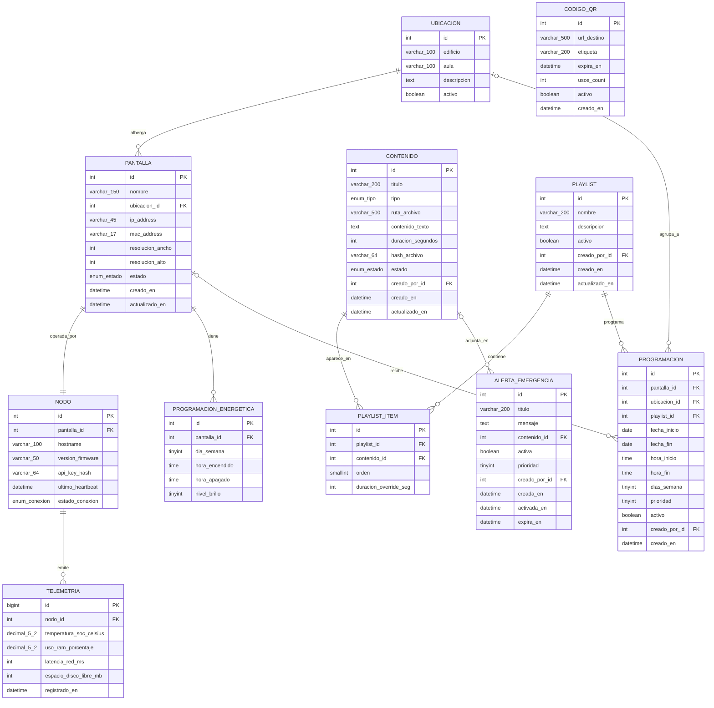

# MER — Modelo Entidad-Relación SPUI

## Base de datos: `spui`

EntityManager propio (`SPUI`) configurado en `doctrine.yaml`, siguiendo el mismo patrón que `sat`, `viaticos` y `sgp`.

---

## Diagrama ERD

---

## Descripción detallada de tablas

### `ubicacion`
Representa una ubicación física dentro del campus (edificio + aula opcional).

| Campo | Tipo MySQL | Nullable | Descripción |
|-------|-----------|----------|-------------|
| `id` | INT UNSIGNED AI | NO | PK |
| `edificio` | VARCHAR(100) | NO | Ej: "Edificio Central", "Aula Magna" |
| `aula` | VARCHAR(100) | SÍ | Ej: "Aula 3", null si es pasillo |
| `descripcion` | TEXT | SÍ | Descripción libre de la ubicación |
| `activo` | TINYINT(1) | NO | Soft delete |

---

### `pantalla`
Display físico conectado a una Raspberry Pi.

| Campo | Tipo MySQL | Nullable | Descripción |
|-------|-----------|----------|-------------|
| `id` | INT UNSIGNED AI | NO | PK |
| `nombre` | VARCHAR(150) | NO | Ej: "Pantalla Hall Entrada" |
| `ubicacion_id` | INT UNSIGNED | NO | FK → ubicacion |
| `ip_address` | VARCHAR(45) | SÍ | IP estática o última IP vista (IPv4/IPv6) |
| `mac_address` | VARCHAR(17) | NO | Formato `AA:BB:CC:DD:EE:FF`, UNIQUE |
| `resolucion_ancho` | SMALLINT UNSIGNED | NO | Píxeles horizontales (ej: 1920) |
| `resolucion_alto` | SMALLINT UNSIGNED | NO | Píxeles verticales (ej: 1080) |
| `estado` | ENUM('activo','inactivo','mantenimiento') | NO | Estado operativo |
| `creado_en` | DATETIME | NO | |
| `actualizado_en` | DATETIME | NO | |

---

### `nodo`
Raspberry Pi registrada y vinculada 1-a-1 con una pantalla.

| Campo | Tipo MySQL | Nullable | Descripción |
|-------|-----------|----------|-------------|
| `id` | INT UNSIGNED AI | NO | PK |
| `pantalla_id` | INT UNSIGNED | NO | FK → pantalla, UNIQUE |
| `hostname` | VARCHAR(100) | NO | Ej: `spui-nodo-01` |
| `version_firmware` | VARCHAR(50) | SÍ | Versión del script cliente Python |
| `api_key_hash` | VARCHAR(64) | NO | SHA-256(api_key) — nunca la key en claro |
| `ultimo_heartbeat` | DATETIME | SÍ | Última vez que el nodo hizo ping |
| `estado_conexion` | ENUM('conectado','desconectado','sin_registrar') | NO | Estado de red |

---

### `contenido`
Ítem multimedia. Puede ser texto, imagen, video o QR.

| Campo | Tipo MySQL | Nullable | Descripción |
|-------|-----------|----------|-------------|
| `id` | INT UNSIGNED AI | NO | PK |
| `titulo` | VARCHAR(200) | NO | Nombre descriptivo |
| `tipo` | ENUM('texto','imagen','video','youtube','qr') | NO | |
| `ruta_archivo` | VARCHAR(500) | SÍ | Ruta relativa en `public/uploads/spui/`. Null para tipo `texto` y `youtube` |
| `contenido_texto` | TEXT | SÍ | Contenido para tipo `texto` o URL de YouTube |
| `duracion_segundos` | SMALLINT UNSIGNED | NO | Tiempo de reproducción (default: 10s) |
| `hash_archivo` | CHAR(64) | SÍ | SHA-256 del archivo para verificar integridad en el Pi |
| `estado` | ENUM('borrador','publicado','archivado') | NO | |
| `creado_por_id` | INT UNSIGNED | NO | FK → `Intranet.user.id` (cross-DB, sin FK en BD) |
| `creado_en` | DATETIME | NO | |
| `actualizado_en` | DATETIME | NO | |

> **Nota cross-DB:** `creado_por_id` referencia `Intranet.user` (BD compartida). No se define FK a nivel MySQL; la validación se hace en la capa de aplicación.

---

### `playlist`
Colección ordenada de contenidos para reproducción secuencial.

| Campo | Tipo MySQL | Nullable | Descripción |
|-------|-----------|----------|-------------|
| `id` | INT UNSIGNED AI | NO | PK |
| `nombre` | VARCHAR(200) | NO | |
| `descripcion` | TEXT | SÍ | |
| `activo` | TINYINT(1) | NO | Soft delete |
| `creado_por_id` | INT UNSIGNED | NO | FK → `Intranet.user.id` |
| `creado_en` | DATETIME | NO | |
| `actualizado_en` | DATETIME | NO | |

---

### `playlist_item`
Vínculo ordenado entre una playlist y un contenido.

| Campo | Tipo MySQL | Nullable | Descripción |
|-------|-----------|----------|-------------|
| `id` | INT UNSIGNED AI | NO | PK |
| `playlist_id` | INT UNSIGNED | NO | FK → playlist |
| `contenido_id` | INT UNSIGNED | NO | FK → contenido |
| `orden` | SMALLINT UNSIGNED | NO | Posición dentro de la playlist (0-indexed) |
| `duracion_override_seg` | SMALLINT UNSIGNED | SÍ | Sobreescribe `contenido.duracion_segundos` para esta playlist |

> **Índice único:** `(playlist_id, orden)` para evitar conflictos de orden.

---

### `programacion`
Regla de scheduling: qué playlist se reproduce, cuándo y dónde.

| Campo | Tipo MySQL | Nullable | Descripción |
|-------|-----------|----------|-------------|
| `id` | INT UNSIGNED AI | NO | PK |
| `pantalla_id` | INT UNSIGNED | SÍ | FK → pantalla. Null si aplica por ubicación |
| `ubicacion_id` | INT UNSIGNED | SÍ | FK → ubicacion. Null si aplica por pantalla individual |
| `playlist_id` | INT UNSIGNED | NO | FK → playlist |
| `fecha_inicio` | DATE | NO | Fecha desde la que aplica la regla |
| `fecha_fin` | DATE | SÍ | Null = sin fecha de vencimiento |
| `hora_inicio` | TIME | NO | Hora de inicio de la franja horaria |
| `hora_fin` | TIME | NO | Hora de fin de la franja horaria |
| `dias_semana` | TINYINT UNSIGNED | NO | Bitmask: bit0=Lun, bit1=Mar, ..., bit6=Dom. Ej: `0b0011111` = Lun-Vie |
| `prioridad` | TINYINT UNSIGNED | NO | Mayor número = mayor prioridad (default: 5) |
| `activo` | TINYINT(1) | NO | |
| `creado_por_id` | INT UNSIGNED | NO | FK → `Intranet.user.id` |
| `creado_en` | DATETIME | NO | |

> **Constraint:** CHECK que `pantalla_id IS NOT NULL OR ubicacion_id IS NOT NULL`.

---

### `alerta_emergencia`
Alerta de máxima prioridad que interrumpe toda programación normal.

| Campo | Tipo MySQL | Nullable | Descripción |
|-------|-----------|----------|-------------|
| `id` | INT UNSIGNED AI | NO | PK |
| `titulo` | VARCHAR(200) | NO | Ej: "EVACUACIÓN — Edificio Central" |
| `mensaje` | TEXT | NO | Texto de la alerta |
| `contenido_id` | INT UNSIGNED | SÍ | FK → contenido. Media opcional adjunta |
| `activa` | TINYINT(1) | NO | Si está activa, overridea toda la programación |
| `prioridad` | TINYINT UNSIGNED | NO | Default: 10 (siempre por encima de programacion.prioridad) |
| `creado_por_id` | INT UNSIGNED | NO | FK → `Intranet.user.id` |
| `creada_en` | DATETIME | NO | |
| `activada_en` | DATETIME | SÍ | Momento en que se activó (puede ser futuro) |
| `expira_en` | DATETIME | SÍ | Null = manual deactivation only |

---

### `codigo_qr`
QR dinámico con URL destino, usable en contenidos de tipo `qr`.

| Campo | Tipo MySQL | Nullable | Descripción |
|-------|-----------|----------|-------------|
| `id` | INT UNSIGNED AI | NO | PK |
| `url_destino` | VARCHAR(500) | NO | URL a la que redirige el QR |
| `etiqueta` | VARCHAR(200) | NO | Ej: "Encuesta satisfacción mayo" |
| `expira_en` | DATETIME | SÍ | Null = sin expiración |
| `usos_count` | INT UNSIGNED | NO | Contador de escaneos (default: 0) |
| `activo` | TINYINT(1) | NO | |
| `creado_en` | DATETIME | NO | |

---

### `telemetria`
Métricas de hardware recibidas desde los nodos vía MQTT. Alta frecuencia de inserción.

| Campo | Tipo MySQL | Nullable | Descripción |
|-------|-----------|----------|-------------|
| `id` | BIGINT UNSIGNED AI | NO | PK — BIGINT por volumen alto |
| `nodo_id` | INT UNSIGNED | NO | FK → nodo |
| `temperatura_soc_celsius` | DECIMAL(5,2) | NO | Temperatura del SoC en °C |
| `uso_ram_porcentaje` | DECIMAL(5,2) | NO | Uso de RAM en % |
| `latencia_red_ms` | SMALLINT UNSIGNED | SÍ | Latencia de red en ms (null si sin red) |
| `espacio_disco_libre_mb` | INT UNSIGNED | NO | Espacio libre en disco |
| `registrado_en` | DATETIME | NO | Timestamp del registro (INDEX junto a nodo_id) |

> **Política de retención:** purgar registros con `registrado_en < NOW() - INTERVAL 90 DAY` via tarea programada Symfony (`symfony/messenger` o cron).
> **Índice compuesto:** `(nodo_id, registrado_en)` para consultas de historial.

---

### `programacion_energetica`
Horario de encendido/apagado y nivel de brillo por pantalla y día de la semana.

| Campo | Tipo MySQL | Nullable | Descripción |
|-------|-----------|----------|-------------|
| `id` | INT UNSIGNED AI | NO | PK |
| `pantalla_id` | INT UNSIGNED | NO | FK → pantalla |
| `dia_semana` | TINYINT UNSIGNED | NO | 1=Lunes ... 7=Domingo |
| `hora_encendido` | TIME | NO | |
| `hora_apagado` | TIME | NO | |
| `nivel_brillo` | TINYINT UNSIGNED | NO | 0-100% |

> **Índice único:** `(pantalla_id, dia_semana)` — una regla por pantalla por día.

---

## Resumen de índices importantes

| Tabla | Índice | Tipo | Propósito |
|-------|--------|------|-----------|
| `pantalla` | `mac_address` | UNIQUE | Identificación física del nodo |
| `nodo` | `pantalla_id` | UNIQUE | Relación 1-a-1 |
| `playlist_item` | `(playlist_id, orden)` | UNIQUE | Orden sin conflictos |
| `telemetria` | `(nodo_id, registrado_en)` | INDEX | Consultas de historial rápidas |
| `programacion_energetica` | `(pantalla_id, dia_semana)` | UNIQUE | Una regla por día |
| `alerta_emergencia` | `activa` | INDEX | Consulta rápida de alertas activas |
