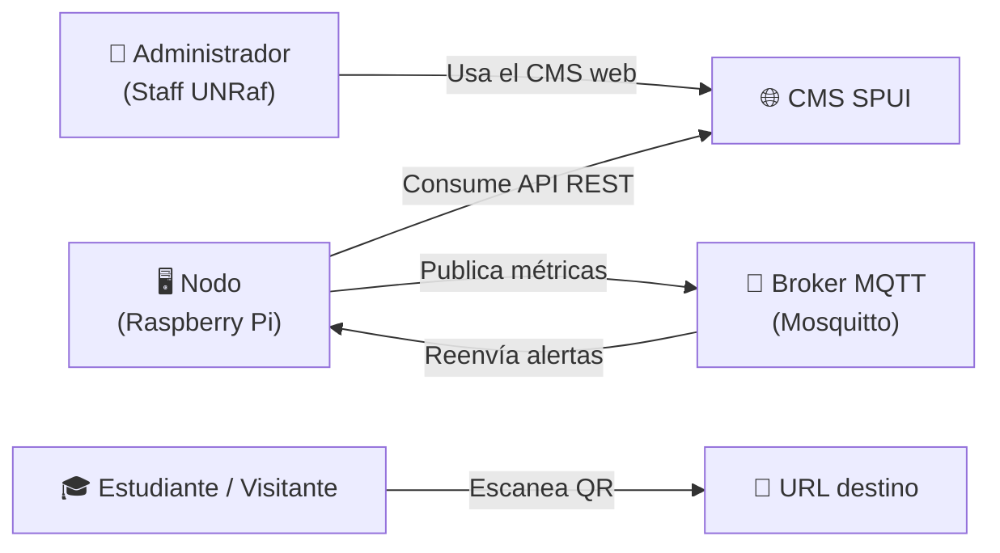

# Casos de Uso — SPUI

## Actores del Sistema

### Descripción de actores

| Actor | Tipo | Descripción |
|-------|------|-------------|
| **Administrador** | Humano — primario | Personal de la UNRaf con acceso al CMS. Gestiona todo el contenido, dispositivos y horarios. |
| **Nodo (Raspberry Pi)** | Sistema — primario | Cliente automatizado que consume la API REST para sincronizar contenido y la API MQTT para telemetría y alertas. |
| **Estudiante / Visitante** | Humano — secundario | Escanea códigos QR mostrados en las pantallas para acceder a contenido adicional. No interactúa directamente con el CMS. |
| **Broker MQTT (Mosquitto)** | Sistema — externo | Intermediario de mensajes para telemetría y alertas. No es actor directo del CMS, pero es parte del ecosistema. |

---

## Casos de Uso

### CU-01 — Gestionar Contenido Multimedia

**Actor:** Administrador  
**Precondición:** El administrador tiene sesión iniciada en el CMS.

**Flujo principal:**
1. El administrador navega a la sección "Contenidos"
2. Selecciona crear nuevo contenido
3. Elige el tipo: `texto`, `imagen`, `video`, `youtube` o `qr`
4. Completa los campos requeridos (título, duración, archivo/URL/texto)
5. El sistema calcula el SHA-256 del archivo y lo almacena
6. Guarda con estado `borrador` o `publicado`

**Flujos alternativos:**
- 3a. Si el tipo es `imagen` o `video`: sube el archivo al servidor, el sistema valida formato y tamaño máximo
- 3b. Si el tipo es `qr`: selecciona o crea un `codigo_qr` asociado
- 6a. Si el archivo supera el límite de tamaño: el sistema muestra error y no guarda

**Postcondición:** El contenido queda disponible para asignarse a playlists.

---

### CU-02 — Crear y Editar Playlist

**Actor:** Administrador

**Flujo principal:**
1. El administrador crea una nueva playlist con nombre y descripción
2. Busca contenidos publicados disponibles
3. Los agrega a la playlist y define su orden
4. Opcionalmente sobreescribe la duración individual de cada ítem
5. Activa la playlist

**Regla de negocio:** Un contenido puede aparecer en múltiples playlists. El orden dentro de cada playlist es independiente.

---

### CU-03 — Programar Reproducción (Scheduling)

**Actor:** Administrador

**Flujo principal:**
1. El administrador accede a "Programación"
2. Selecciona una playlist existente
3. Define el alcance: pantalla individual o ubicación (edificio/aula)
4. Define la franja horaria: fecha de inicio/fin, hora inicio/fin, días de la semana
5. Define la prioridad (para resolver conflictos de horario solapado)
6. Activa la regla

**Flujos alternativos:**
- 3a. Si se selecciona una ubicación, la regla aplica a todas las pantallas de esa ubicación
- 5a. Si existen reglas solapadas, el nodo aplica la de mayor prioridad

**Postcondición:** Los nodos correspondientes incorporarán la regla en su próxima sincronización.

---

### CU-04 — Emitir Alerta de Emergencia

**Actor:** Administrador  
**Prioridad:** Crítica

**Flujo principal:**
1. El administrador accede al módulo de Alertas
2. Crea una nueva alerta con título y mensaje de emergencia
3. Opcionalmente adjunta un contenido multimedia
4. Activa la alerta inmediatamente
5. El CMS publica el evento en el broker MQTT en el topic `spui/alerts`
6. Todos los nodos suscritos reciben la alerta vía MQTT
7. Los nodos interrumpen la reproducción actual y muestran la alerta

**Regla de negocio:** Mientras `alerta_emergencia.activa = true`, los nodos ignoran toda programación regular.

**Flujos alternativos:**
- 4a. El administrador programa la alerta para una fecha/hora futura (`activada_en`)
- 7a. Si el nodo está offline: al reconectarse detecta la alerta activa en el primer sync

**Postcondición:** Todos los nodos en línea muestran la alerta en segundos. Persiste hasta que el admin la desactiva manualmente o hasta `expira_en`.

---

### CU-05 — Registrar Nodo en el Sistema

**Actor:** Administrador  
**Precondición:** La Raspberry Pi está instalada y conectada a la red.

**Flujo principal:**
1. El administrador accede a "Dispositivos" → "Registrar nuevo nodo"
2. Ingresa el nombre de la pantalla, la ubicación y el hostname del nodo
3. El sistema genera una API key aleatoria (32 bytes hex)
4. Muestra la API key al administrador **una sola vez** (no se puede recuperar después)
5. El administrador copia la key y la configura en el script cliente de la Raspberry Pi
6. El sistema almacena solo el hash SHA-256 de la key

**Postcondición:** El nodo puede autenticarse en la API usando la key generada.

**Flujo alternativo:**
- 6a. Si el admin pierde la key: generar una nueva (revoca la anterior)

---

### CU-06 — Sincronizar Contenido (Nodo → CMS)

**Actor:** Nodo (Raspberry Pi)  
**Precondición:** El nodo tiene conexión de red y API key válida.

**Flujo principal:**
1. El nodo envía `GET /api/nodo/sync` con su API key
2. El CMS valida la key
3. El CMS calcula qué playlist debe reproducirse en este momento (fecha, hora, días, prioridad)
4. Responde con la lista de contenidos a reproducir y sus metadatos (ruta, hash, duración)
5. El nodo descarga solo los archivos cuyo SHA-256 no coincide con la copia local
6. Actualiza su SQLite local con la nueva programación
7. Confirma sync exitoso con `POST /api/nodo/heartbeat`

**Frecuencia:** El nodo hace sync cada 5 minutos (configurable).

---

### CU-07 — Reproducir Contenido en Pantalla

**Actor:** Nodo (Raspberry Pi)  
**Precondición:** El nodo tiene al menos una playlist cacheada en SQLite.

**Flujo principal:**
1. El daemon del player consulta SQLite para determinar qué playlist reproducir ahora
2. Reproduce los ítems de la playlist en orden, respetando duraciones
3. Al finalizar la playlist, vuelve al ítem 1 (loop)
4. Cada X minutos intenta sincronizar con el CMS para recibir actualizaciones

**Flujo alternativo (offline):**
- Si no hay conexión de red: el player continúa reproduciendo desde SQLite local indefinidamente
- Si SQLite está vacío (primera instalación sin red): muestra pantalla de stand-by institucional

---

### CU-08 — Enviar Telemetría de Hardware

**Actor:** Nodo (Raspberry Pi)  
**Precondición:** El broker MQTT (Mosquitto) está disponible.

**Flujo principal:**
1. El daemon de telemetría del nodo mide cada 60 segundos:
   - Temperatura del SoC (vía `vcgencmd measure_temp`)
   - Uso de RAM (`psutil.virtual_memory()`)
   - Latencia de red (ping al CMS)
   - Espacio libre en disco
2. Publica el JSON en el topic MQTT `spui/telemetria/<nodo_id>`
3. El CMS (suscrito al broker) recibe el mensaje
4. Inserta el registro en la tabla `telemetria`
5. Si la temperatura supera 80°C: el CMS genera una alerta visual en el dashboard del admin

**Flujo alternativo:**
- Si el broker MQTT no está disponible: el nodo acumula las métricas en un buffer local y las reenvía cuando el broker vuelve

---

### CU-09 — Operar en Modo Offline (Fail-Safe)

**Actor:** Nodo (Raspberry Pi)  
**Precondición:** El nodo pierde la conexión de red con el CMS.

**Flujo principal:**
1. El nodo detecta que el CMS no responde (timeout en sync)
2. Continúa reproduciendo el contenido cacheado en SQLite local
3. Registra el estado offline internamente
4. Cada 30 segundos intenta reconectarse al CMS
5. Al recuperar conexión: hace sync inmediato para obtener actualizaciones

**Postcondición:** El nodo nunca muestra pantalla en negro o de error. El contenido desactualizado es mejor que la ausencia de contenido.

---

### CU-10 — Escanear Código QR

**Actor:** Estudiante / Visitante  
**Precondición:** Una pantalla está mostrando un contenido de tipo `qr`.

**Flujo principal:**
1. El estudiante escanea el QR con su celular
2. El dispositivo abre la URL del endpoint del CMS: `GET /qr/{id}/redirect`
3. El CMS incrementa `codigo_qr.usos_count`
4. Verifica si el QR está activo y no expiró
5. Redirige al `url_destino` (formulario, página web, documento, etc.)

**Flujo alternativo:**
- 4a. Si el QR expiró o está inactivo: muestra página de error amigable

---

### CU-11 — Programar Encendido/Apagado de Pantalla

**Actor:** Administrador

**Flujo principal:**
1. El administrador accede a "Energía" de una pantalla específica
2. Define para cada día de la semana: hora de encendido, hora de apagado y nivel de brillo
3. Guarda la configuración en `programacion_energetica`
4. El nodo, en su próximo sync, recibe el horario energético
5. A la hora programada, el nodo envía la señal CEC a la pantalla o controla el GPIO

**Beneficio:** Ahorro energético en horarios nocturnos o fines de semana.

---

### CU-12 — Monitorear Estado de Nodos

**Actor:** Administrador

**Flujo principal:**
1. El administrador accede al "Dashboard" del CMS
2. Ve la lista de todos los nodos con su estado (conectado / desconectado / mantenimiento)
3. Puede ver las métricas de telemetría en tiempo real y el historial gráfico
4. Recibe alertas visuales si un nodo tiene temperatura alta o lleva más de N minutos sin heartbeat

---

## Matriz de casos de uso por actor

| Caso de Uso | Administrador | Nodo (Pi) | Estudiante |
|-------------|:---:|:---:|:---:|
| CU-01 Gestionar contenido | ✅ | — | — |
| CU-02 Crear playlist | ✅ | — | — |
| CU-03 Programar reproducción | ✅ | — | — |
| CU-04 Emitir alerta emergencia | ✅ | — | — |
| CU-05 Registrar nodo | ✅ | — | — |
| CU-06 Sincronizar contenido | — | ✅ | — |
| CU-07 Reproducir contenido | — | ✅ | — |
| CU-08 Enviar telemetría | — | ✅ | — |
| CU-09 Operar modo offline | — | ✅ | — |
| CU-10 Escanear QR | — | — | ✅ |
| CU-11 Programar energía | ✅ | ✅ (ejecuta) | — |
| CU-12 Monitorear nodos | ✅ | — | — |
