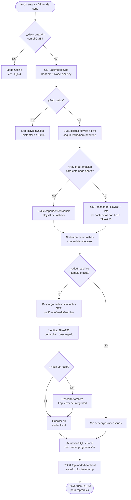
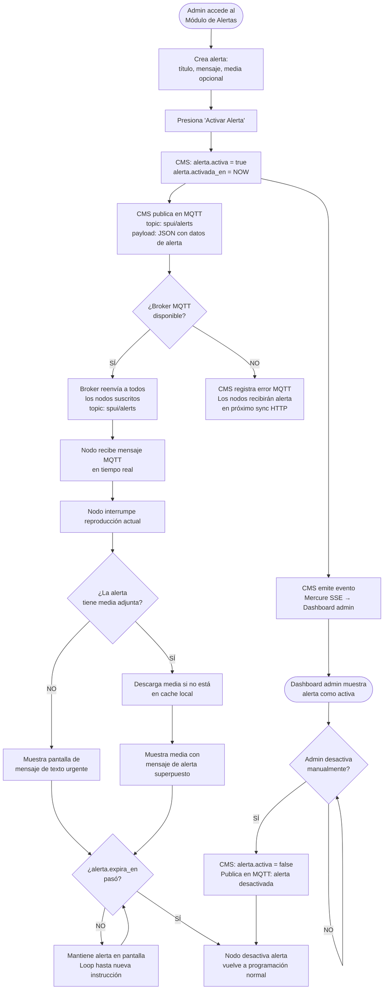
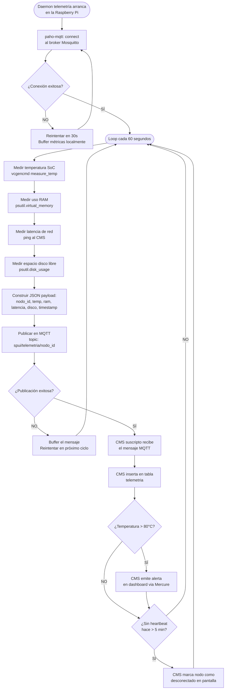
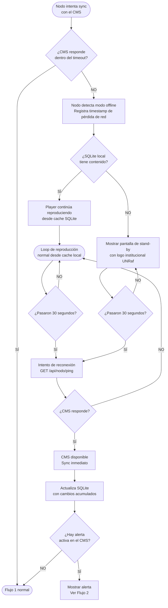
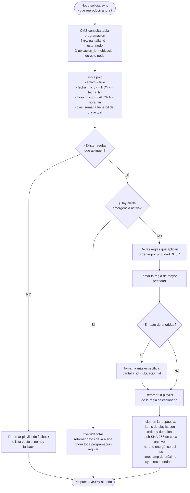

# Diagramas de Flujo — SPUI

## Flujo 1 — Sincronización de Contenido (Nodo ↔ CMS)

El ciclo normal de operación de un nodo: pide al CMS qué reproducir, descarga los archivos necesarios y actualiza su cache local.

---

## Flujo 2 — Emisión de Alerta de Emergencia

El flujo más crítico del sistema. Debe completarse en segundos desde que el admin activa la alerta.

---

## Flujo 3 — Ciclo de Telemetría MQTT

El nodo envía métricas de hardware cada 60 segundos para monitoreo preventivo.

---

## Flujo 4 — Modo Offline / Fail-Safe

El nodo pierde conexión con el CMS. El sistema debe seguir operando sin interrupciones visibles.

---

## Flujo 5 — Determinación de Playlist Activa (Lógica del CMS)

Algoritmo que el CMS ejecuta para responder a cada solicitud de sync de un nodo.

