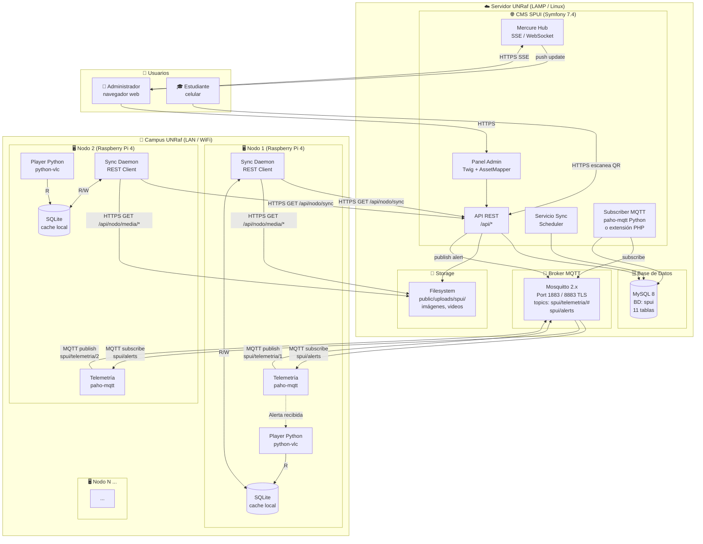
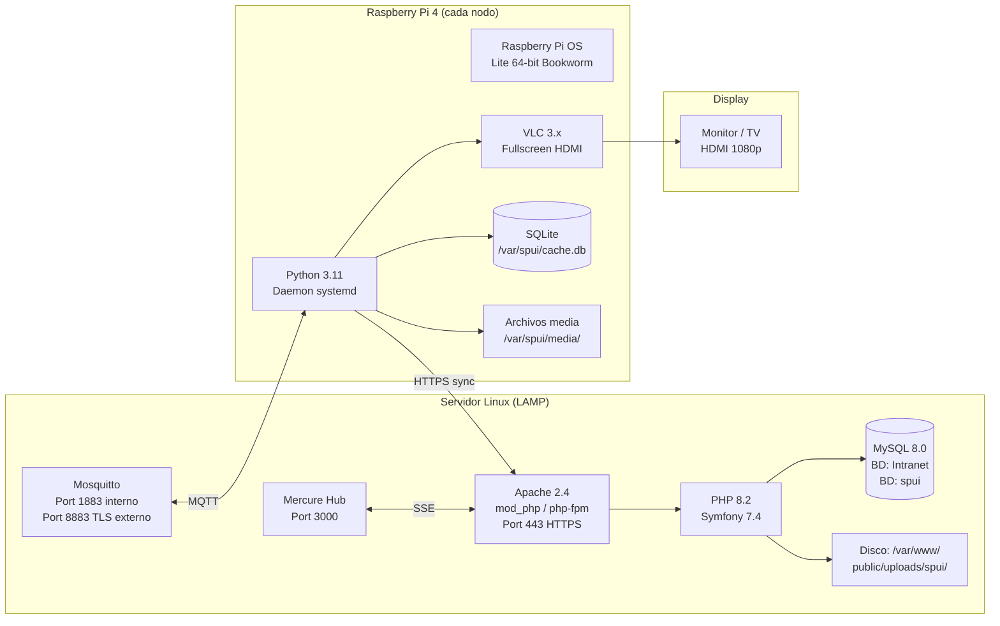

# Arquitectura del Sistema — SPUI

## Visión general

El sistema SPUI sigue una arquitectura distribuida cliente-servidor con tres capas principales:
1. **CMS central** (servidor en la nube / LAMP) — gestión y distribución de contenidos
2. **Broker de mensajería** (MQTT) — telemetría y alertas en tiempo real
3. **Nodos cliente** (Raspberry Pi) — reproducción y monitoreo en campo

---

## Diagrama de Componentes (C4 — Nivel 2: Containers)



---

## Diagrama de Despliegue



---

## Protocolo de comunicación por flujo

| Flujo | Protocolo | Dirección | Frecuencia |
|-------|-----------|-----------|-----------|
| Sync de contenido | HTTPS REST (JSON) | Pi → CMS | Cada 5 min |
| Descarga de media | HTTPS (stream binario) | Pi → CMS | Solo cuando hay cambios |
| Heartbeat | HTTPS REST | Pi → CMS | Cada 5 min (con el sync) |
| Telemetría | MQTT (QoS 1) | Pi → Broker → CMS | Cada 60 seg |
| Alerta de emergencia | MQTT (QoS 2) | CMS → Broker → Pi | Inmediato (push) |
| Dashboard tiempo real | Mercure SSE | CMS → Browser | Reactivo a eventos |
| QR redirect | HTTPS | Celular → CMS | Por escaneo |

---

## Estructura de tópicos MQTT

```
spui/
├── telemetria/
│   ├── {nodo_id}          ← Métricas del nodo (publicado por el Pi)
├── alerts                  ← Alertas de emergencia (publicado por CMS)
└── control/
    └── {nodo_id}/
        ├── power           ← Comando encendido/apagado pantalla
        └── brightness      ← Comando nivel de brillo
```

---

## Seguridad por capa

| Capa | Mecanismo |
|------|-----------|
| HTTPS (CMS ↔ Pi) | TLS 1.3, certificado del servidor |
| Auth de nodo | Header `X-Node-Api-Key` con hash SHA-256 en BD |
| Auth de admin | Symfony Security (sesión, roles) — sistema Shared existente |
| Integridad de media | SHA-256 del archivo verificado por el Pi al descargar |
| MQTT | Autenticación por usuario/contraseña (Mosquitto ACL); TLS en port 8883 para producción |
| Rate limiting | `symfony/rate-limiter` en endpoints de API públicos |

---

## Estructura de directorios del proyecto (objetivo final)

```
apps/spui/
├── docs/                          ← Esta carpeta de documentación
│   ├── 00_investigacion_tecnologias.md
│   ├── 01_mer_base_datos.md
│   ├── 02_casos_de_uso.md
│   ├── 03_diagramas_flujo.md
│   ├── 04_gantt.md
│   └── 05_arquitectura_sistema.md
├── migrations/                    ← Migraciones Doctrine del EntityManager SPUI
│   └── Version202607XXXXXXXX.php
├── src/
│   ├── Controller/
│   │   ├── Api/                   ← Endpoints REST para nodos
│   │   │   ├── NodoSyncController.php
│   │   │   ├── AlertaController.php
│   │   │   └── QrController.php
│   │   └── Admin/                 ← Panel CMS (Twig)
│   │       ├── DashboardController.php
│   │       ├── ContenidoController.php
│   │       ├── PlaylistController.php
│   │       └── ProgramacionController.php
│   ├── Entity/
│   │   ├── Ubicacion.php
│   │   ├── Pantalla.php
│   │   ├── Nodo.php
│   │   ├── Contenido.php
│   │   ├── Playlist.php
│   │   ├── PlaylistItem.php
│   │   ├── Programacion.php
│   │   ├── AlertaEmergencia.php
│   │   ├── CodigoQr.php
│   │   ├── Telemetria.php
│   │   └── ProgramacionEnergetica.php
│   ├── Repository/
│   │   └── (un repo por entidad)
│   └── Service/
│       ├── StorageService.php      ← Abstracción de almacenamiento de archivos
│       ├── SchedulerService.php    ← Lógica de determinación de playlist activa
│       ├── MqttPublisherService.php
│       └── NodeAuthService.php     ← Validación de API keys de nodos
└── client/                        ← Código Python para Raspberry Pi
    ├── main.py
    ├── player.py                  ← python-vlc
    ├── sync_daemon.py             ← REST client
    ├── telemetry_daemon.py        ← paho-mqtt
    ├── offline_cache.py           ← SQLite
    └── requirements.txt
```
